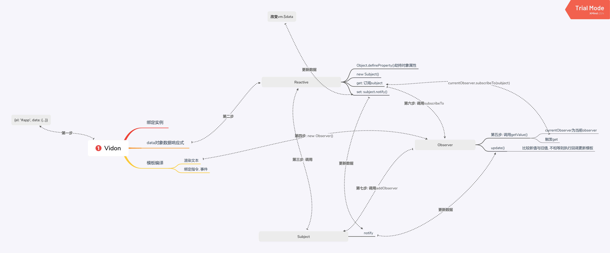

<h1 align="center">Welcome to Vidon 👋</h1>
<p>
  
  <a href="#" target="_blank">
    
  </a>
</p>

> 一个以纯JS实现的简易MVVM框架

### 🏠 [源码地址](https://github.com/wanmaoor/Vidon)

### ✨ [预览地址](https://wanmaoor.github.io/Vidon/)

## Description



## Install

```sh
yarn install
```

## Usage

```sh
yarn run start
```

## Author

👤 **wan mao**

* Website: https://wanmaoor.github.io/
* Github: [@wanmaoor](https://github.com/wanmaoor)

## Show your support

Give a ⭐️ if this project helped you!

***
_This README was generated with ❤️ by [readme-md-generator](https://github.com/kefranabg/readme-md-generator)_